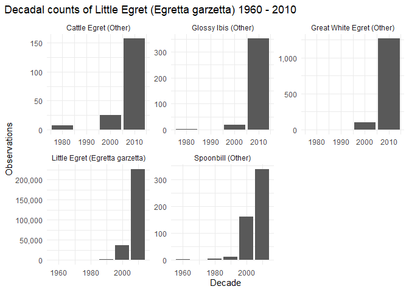
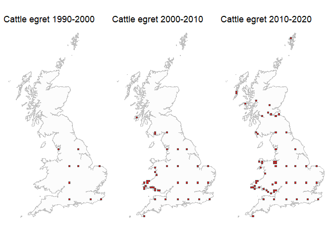
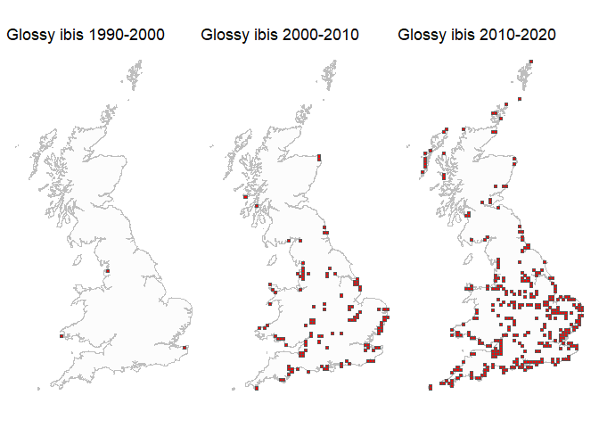
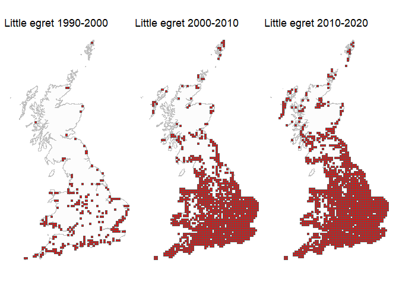
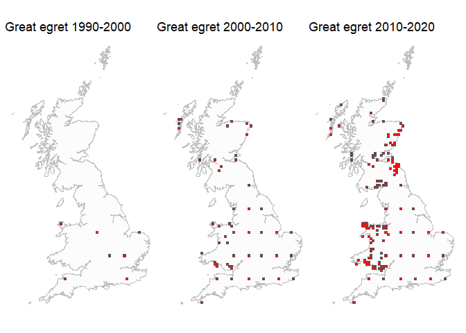
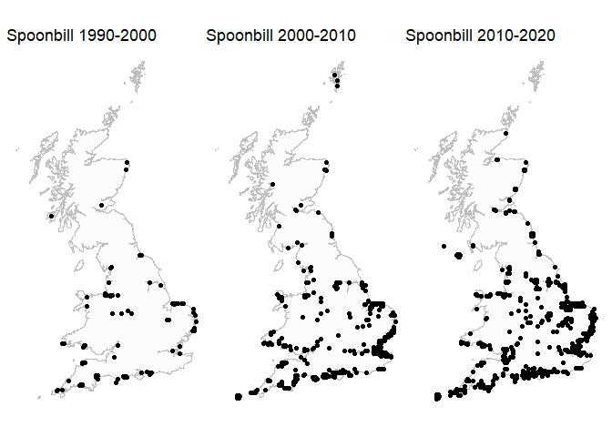

E011 - Landscapes
================
2050707
11/11/2021

## Uncertainty

| start_date_year | Glossy Ibis | Great White Egret | Little Egret | Spoonbill | Cattle Egret |        NA |
|----------------:|------------:|------------------:|-------------:|----------:|-------------:|----------:|
|            1990 |    7071.100 |          35355.30 |     3013.903 |  6316.847 |           NA |        NA |
|            1991 |    7071.100 |                NA |     2965.338 |  7071.100 |           NA |        NA |
|            1992 |    7071.100 |                NA |     3020.486 |  6995.338 |     35355.30 |        NA |
|            1993 |          NA |          35355.30 |     2118.091 |  6942.534 |     35355.30 |        NA |
|            1994 |          NA |          35355.30 |     2817.569 |  7071.100 |     35355.30 |        NA |
|            1995 |          NA |          14142.15 |     2948.240 |  7071.100 |           NA |        NA |
|            1996 |    4242.650 |          35355.30 |     2600.916 |  6534.671 |     35355.30 |        NA |
|            1997 |    7071.100 |          31314.70 |     3068.823 |  7071.100 |     35355.30 |        NA |
|            1998 |          NA |          34223.93 |     2575.180 |  6819.889 |     35355.30 |        NA |
|            1999 |    7071.100 |            707.10 |     3375.404 |  6573.913 |     35355.30 |        NA |
|            2000 |          NA |          19931.57 |     4317.486 |  6343.786 |     35355.30 |        NA |
|            2001 |          NA |          31003.88 |     4507.028 |  7071.100 |     35355.30 |        NA |
|            2002 |    7071.100 |          28270.64 |     4962.652 |  6856.556 |     35355.30 |        NA |
|            2003 |    7071.100 |          33919.98 |     4649.633 |  6731.829 |     35355.30 |        NA |
|            2004 |    7071.100 |          17040.49 |     3872.515 |  6485.678 |     35355.30 |   707.100 |
|            2005 |    6465.005 |          28362.81 |     3111.434 |  6599.693 |     35355.30 |        NA |
|            2006 |    7071.100 |          33282.20 |     2868.171 |  6933.797 |     35355.30 |        NA |
|            2007 |    7071.100 |          34021.83 |     2672.880 |  6765.804 |     32449.82 |        NA |
|            2008 |    6994.135 |          32045.97 |     3215.819 |  6505.231 |     31367.03 |   707.100 |
|            2009 |    6372.911 |          31371.36 |     3065.804 |  6554.544 |     30993.77 | 35355.300 |
|            2010 |    6887.107 |          27134.30 |     3061.663 |  6494.657 |     31338.94 |        NA |
|            2011 |    6802.885 |          29997.98 |     3019.568 |  6942.390 |     34186.53 |        NA |
|            2012 |    6371.463 |          29051.15 |     2555.209 |  6989.024 |     34200.36 | 35355.300 |
|            2013 |    6274.689 |          31556.16 |     2139.377 |  6949.161 |     35355.30 | 35355.300 |
|            2014 |    6435.369 |          32380.42 |     1950.059 |  6920.915 |     32873.31 | 35355.300 |
|            2015 |    6653.084 |          30242.45 |     2053.192 |  7005.534 |     26289.94 |  7071.100 |
|            2016 |    6626.091 |          32426.73 |     1824.820 |  6971.339 |     34282.67 |  7071.100 |
|            2017 |    6836.663 |          33476.63 |     1682.433 |  6884.343 |     33037.62 | 13132.000 |
|            2018 |    6794.200 |          33602.99 |     1659.929 |  6823.636 |     34216.99 |  7537.487 |
|            2019 |    5771.456 |          32749.05 |     1460.064 |  6722.531 |     33894.29 |  9899.520 |
|            2020 |    7071.100 |          34498.20 |     1111.248 |  7071.100 |     35355.30 |        NA |
|            2021 |          NA |          35355.30 |      759.695 |        NA |     35355.30 |        NA |

-   Note observation inaccuracy in Great White Egret and Cattle Egret
    observations

## Introduction / background

## Method

## BBS data

### Exploratory analysis

<!-- -->

# Count species by decade by 10 km grid square

    ## # A tibble: 7 x 7
    ## # Groups:   scientific_name [7]
    ##   scientific_name           `1960` `1970` `1980` `1990` `2000` `2010`
    ##   <chr>                      <int>  <int>  <int>  <int>  <int>  <int>
    ## 1 Ardea alba                     0      0      3      5     47    150
    ## 2 Ardea alba alba                0      0      0      0      1      0
    ## 3 Bubulcus ibis                  0      0      3      0     25     44
    ## 4 Egretta garzetta               4     17     66    231   1330   1819
    ## 5 Egretta garzetta garzetta      0      1      0      0      0     32
    ## 6 Platalea leucorodia           14     20     67     87    223    321
    ## 7 Plegadis falcinellus           0      4     15      8    104    352

    ##  [1]  1  3  5  7  9 11 13 15 17 19 25 27 29 34 36 38

## Cattle egret

<!-- -->

## Glossy ibis

<!-- -->

## Little egret

<!-- -->

## Great egret

<!-- -->

## Spoonbill

<!-- -->
